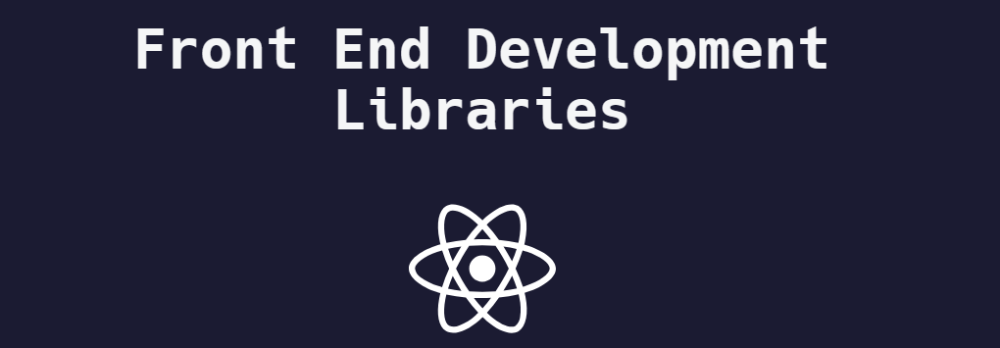

# Frontend Development with React Certification Projects

Welcome! This repository hosts the projects that are part of my journey to obtain the Frontend Development with React Certification from FreeCodeCamp. Each project has been designed and built to showcase my skills in frontend development using React as the primary library.

Through these projects, I have gained experience in React usage, DOM manipulation, state management, routing, and developing modern and user-friendly user interfaces.

## Projects

1. **Random Quote Machine**
   - [Preview](https://randomquote-black.vercel.app/)
   - Description: An application that displays random quotes and allows sharing them on Twitter.

2. **Markdown Previewer**
   - [Preview](https://markdown-previewer-md.netlify.app/)
   - Description: A Markdown editor that shows real-time previews of the formatted content.

3. **Drum Machine**
   - [Preview](https://drum-machine-react-fcc1.netlify.app/)
   - Description: An interactive drum machine that plays sounds when clicking buttons or using specific keys.
4. **JavaScript Calculator**
   - [Preview](https://calculator-fcc-react.netlify.app/)
   - Description: A functional calculator that performs basic math operations.

5. **25 + 5 Clock**
   - [Preview](https://25-5-clock-fcc-react.netlify.app/)
   - Description: A Pomodoro clock that alternates between work and break time intervals.

## How to View Each Project

You can explore each project individually by navigating to its corresponding folder. There, you will find detailed information about the project and how to run it locally.

## How to Run the Projects

To run any of the projects on your local machine, follow the detailed instructions in the README.md file of each specific folder. Generally, you'll need to follow these steps:

1. Clone this repository on your local machine.
2. Navigate to the folder of the project you want to see.
3. Install the necessary dependencies using the package manager (e.g., npm or yarn).
4. Run the application in development mode with the appropriate command (e.g., `npm start` or `yarn start`).
5. Open your browser and visit [http://localhost:3000/](http://localhost:3000/) to see the project in action.

## Additional Resources

For more information about FreeCodeCamp or the Frontend Development with React Certification, visit the official FreeCodeCamp website: [https://www.freecodecamp.org/](https://www.freecodecamp.org/)

Thanks for visiting my repository and reviewing my projects! If you have any questions or suggestions, feel free to contact me. You can find me on [Your GitHub Profile](https://github.com/ismanolgarcia).

Happy coding! 🚀
