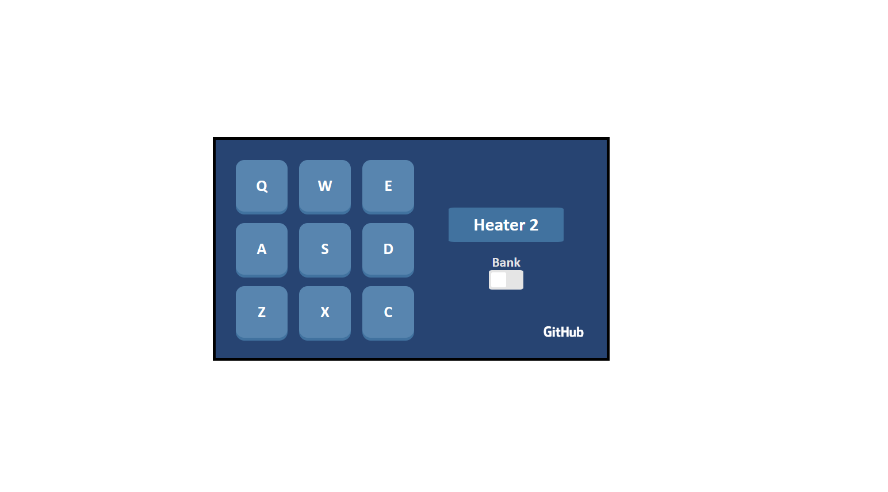

# Build a Drum Machine
Note: React 18 has known incompatibilities with the tests for this project (see issue)

### Objective: Build an app that is functionally similar to this: [Drum Machine](https://drum-machine.freecodecamp.rocks/)

Fulfill the below user stories and get all of the tests to pass. Use whichever libraries or APIs you need. Give it your own personal style.

You can use any mix of HTML, JavaScript, CSS, Bootstrap, SASS, React, Redux, and jQuery to complete this project. You should use a frontend framework (like React for example) because this section is about learning frontend frameworks. Additional technologies not listed above are not recommended and using them is at your own risk. We are looking at supporting other frontend frameworks like Angular and Vue, but they are not currently supported. We will accept and try to fix all issue reports that use the suggested technology stack for this project. Happy coding!

- User Story #1: I should be able to see an outer container with a corresponding id="drum-machine" that contains all other elements.

- User Story #2: Within #drum-machine I can see an element with a corresponding id="display".

- User Story #3: Within #drum-machine I can see 9 clickable drum pad elements, each with a class name of drum-pad, a unique id that describes the audio clip the drum pad will be set up to trigger, and an inner text that corresponds to one of the following keys on the keyboard: Q, W, E, A, S, D, Z, X, C. The drum pads MUST be in this order.

- User Story #4: Within each .drum-pad, there should be an HTML5 audio element which has a src attribute pointing to an audio clip, a class name of clip, and an id corresponding to the inner text of its parent .drum-pad (e.g. id="Q", id="W", id="E" etc.).

- User Story #5: When I click on a .drum-pad element, the audio clip contained in its child audio element should be triggered.

- User Story #6: When I press the trigger key associated with each .drum-pad, the audio clip contained in its child audio element should be triggered (e.g. pressing the Q key should trigger the drum pad which contains the string Q, pressing the W key should trigger the drum pad which contains the string W, etc.).

- User Story #7: When a .drum-pad is triggered, a string describing the associated audio clip is displayed as the inner text of the #display element (each string must be unique).

Here are some audio samples you can use for your drum machine:

- Heater 1
- Heater 2
- Heater 3
- Heater 4
- Clap
- Open-HH
- Kick-n'-Hat
- Kick
- Closed-HH

[Preview](https://drum-machine-react-fcc1.netlify.app/)

